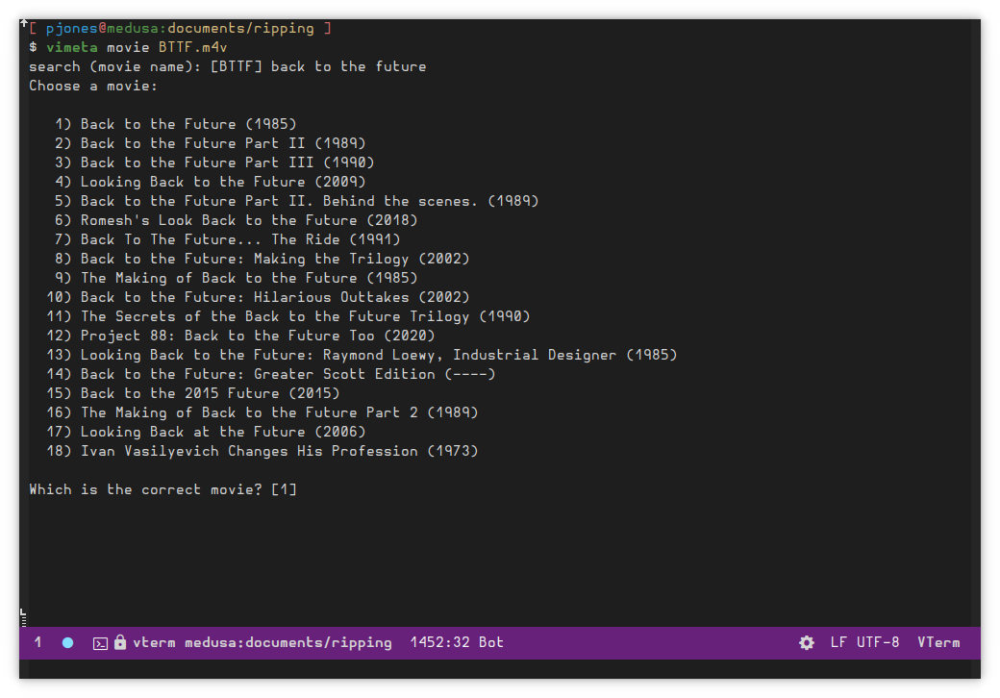

# Vimeta: frontend for video metadata tagging tools

Vimeta is a tool to fetch video metadata from the interwebs and update
video files using a tagging tool.

## Documentation

You can read the man page [online](doc/vimeta.1.md).

### Generating the `man` Page from Source

    $ pandoc -s -t man doc/vimeta.1.md -o doc/vimeta.1

## Installing Vimeta

### Pre-Built Binaries

Each release includes binaries for Windows, macOS, and Linux.

### Building via `nixpkgs`

The easiest way to build vimeta from source is to use [`nix`][nix]:

  1. Install [`nix`][nix]

  2. Install vimeta:

         $ nix-env -f https://github.com/pjones/vimeta/archive/trunk.tar.gz -i

### Building via `cabal`

        $ cabal install vimeta

[nix]: https://nixos.org/
